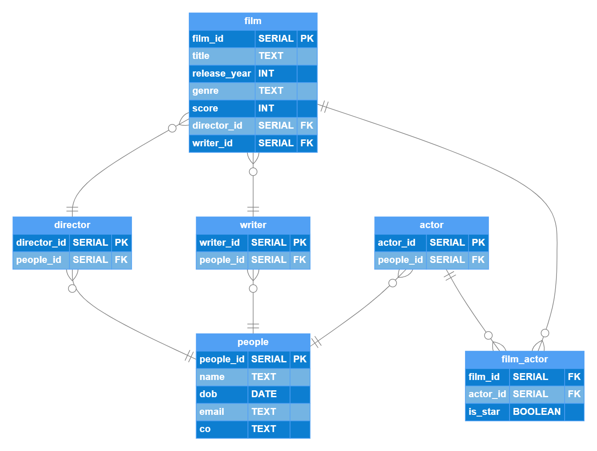

# C# API Exercise

## Completed

Considering dropping the "actor", "director" and "writer" tables, as this information can be found by using the "person" table and joining on either "film" or a many-to-many connection to film.

My `Cast` table is renamed to `film_actor`.

There are two sets of data.
- If you want the original data, use the insert files in [sql folder](sql).
- If you want the extended (AI generated) data, use [main.sql](alt/inserts/main.sql).

Before using either, you should run [create_tables.sql](sql\create_tables.sql).

All queries can be found in [queries.sql](sql\queries.sql).

## Learning Objectives

- Introduce SQL version of FKs and demonstrate how they relate to PKs in other tables
- Elaborate on the link between one-to-zero and one-to-many relationships between the tables
- Show how database normalisation removes redundancy in a database (and why this is a good thing)
- Explain how and why normalisation affects the ERD and the relationships it encapsulates.
- Introduce common joins
- Demonstrate joins using SQL

## Instructions

- Fork this repository
- Clone your fork to your machine

Look at the data shown below as a single monolithic table.

| ID  | Title                 | Director               | Director Country | Star              | Star DOB   | Writer                   | Writer Email          | Year | Genre           | Score |
| --- | --------------------- | ---------------------- | ---------------- | ----------------- | ---------- | ------------------------ | --------------------- | ---- | --------------- | ----- |
| 1   | 2001: A Space Odyssey | Stanley Kubrick        | USA              | Keir Dullea       | 30/05/1936 | Arthur C Clarke          | arthur@clarke.com     | 1968 | Science Fiction | 10    |
| 2   | Star Wars: A New Hope | George Lucas           | USA              | Mark Hamill       | 25/09/1951 | George Lucas             | george@email.com      | 1977 | Science Fiction | 7     |
| 3   | To Kill A Mockingbird | Robert Mulligan        | USA              | Gregory Peck      | 05/04/1916 | Harper Lee               | harper@lee.com        | 1962 | Drama           | 10    |
| 4   | Titanic               | James Cameron          | Canada           | Leonardo DiCaprio | 11/11/1974 | James Cameron            | james@cameron.com     | 1997 | Romance         | 5     |
| 5   | Dr Zhivago            | David Lean             | UK               | Julie Christie    | 14/04/1940 | Boris Pasternak          | boris@boris.com       | 1965 | Historical      | 8     |
| 6   | El Cid                | Anthony Mann           | USA              | Charlton Heston   | 04/10/1923 | Frederick Frank          | fred@frank.com        | 1961 | Historical      | 6     |
| 7   | Voyage to Cythera     | Theodoros Angelopoulos | Greece           | Manos Katrakis    | 14/08/1908 | Theodoros Angelopoulos   | theo@angelopoulos.com | 1984 | Drama           | 8     |
| 8   | Soldier of Orange     | Paul Verhoeven         | Netherlands      | Rutger Hauer      | 23/01/1944 | Erik Hazelhoff Roelfzema | erik@roelfzema.com    | 1977 | Thriller        | 8     |
| 9   | Three Colours: Blue   | Krzysztof Kieslowski   | Poland           | Juliette Binoche  | 09/03/1964 | Krzysztof Kieslowski     | email@email.com       | 1993 | Drama           | 8     |
| 10  | Cyrano de Bergerac    | Jean-Paul Rappeneau    | France           | Gerard Depardieu  | 27/12/1948 | Edmond Rostand           | edmond@rostand.com    | 1990 | Historical      | 9     |

## Core Task

1. Normalise the data shown in the table so that it has multiple tables (Film, Director, Star and Writer) with an appropriate Primary Key for each and suitable Foreign Key relationships set up so that the data can still be linked together as needed.
2. Save your database schema and the data that will be generated by it into a suitable file in the repository as a planning document. This could be a physical ERD diagram of the tables.
3. Open TablePlus and connect to your ElephantSQL database
4. You are going to create some tables to match the schema
5. Then populate the tables with the data shown
6. Once you have the tables and data set up then you need to create queries to return the data needed as shown below:

   1. Show the title and director name for all films
   2. Show the title, director and star name for all films
   3. Show the title of films where the director is from the USA
   4. Show only those films where the writer and the director are the same person
   5. Show directors and film titles for films with a score of 8 or higher
   6. Make at least 5 more queries to demonstrate your understanding of joins, and other relationships between tables.

7. Save each query in its own file and then once you have completed them all push the repository back up to GitHub and create a Pull Request as normal.

## Extension Task 1

1. Refactor the database tables so that the Actors, Directors and Writers all identify people (using a Foreign Key) that are present in a single People table
2. Where necessary refactor the queries to take advantage of this new structure

## Extension Task 2

1. Add a `Cast` table that links Films to Actors (ie the Cast table contains details of all of the Actors in addition to the Star who appear in the Film).
2. You can either add some more people as actors (these can be real actors or just made up names) or just reuse all of the existing people.
